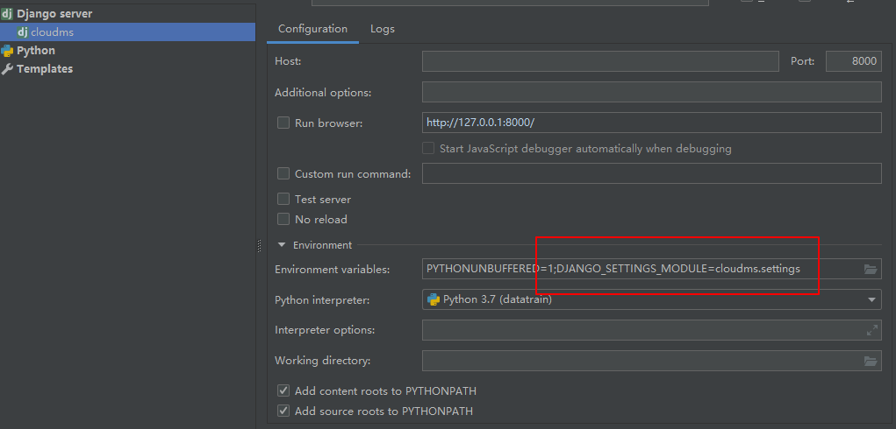

# anaconda环境下 django报错

### 缺少依赖库 sqlparse

```
sqlparse
```

### 找不到模块 

sqlite3

需要添加`sqlite3.dll`在DLLs文件夹里面

参考

[from _sqlite3 import * ImportError: DLL load failed: 找不到指定的模块。](<https://www.cnblogs.com/nightwindnw/p/10852063.html>)

<https://sqlite.org/download.html>

[【出错笔记】Anaconda Sqlite3 ImportError: DLL load failed 问题解决](<https://blog.csdn.net/frostime/article/details/86762858>)


### pycharm配置django运行环境

报错：

> django.core.exceptions.ImproperlyConfigured: Requested setting DEBUG,

解决方案：



设置manage.py和settings.py 文件到配置文件中

DJANGO_SETTINGS_MODULE