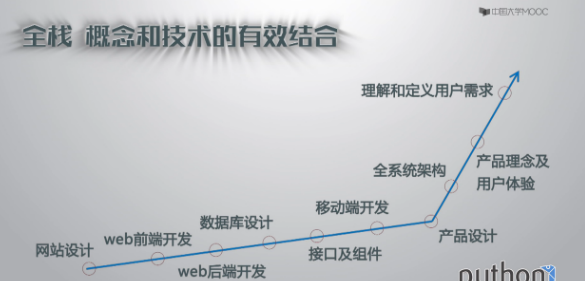
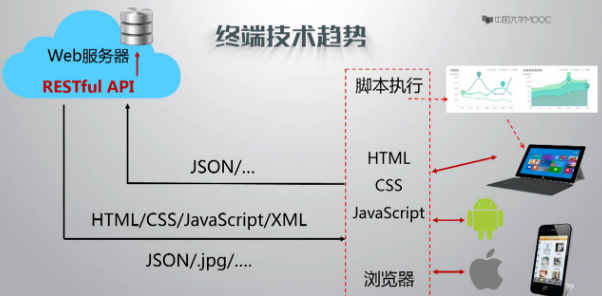
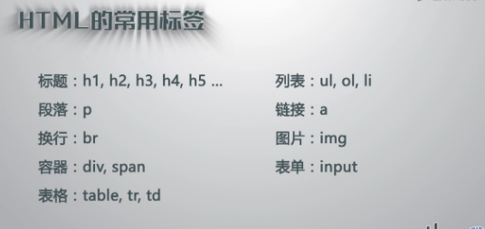
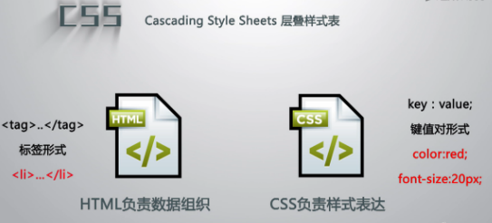
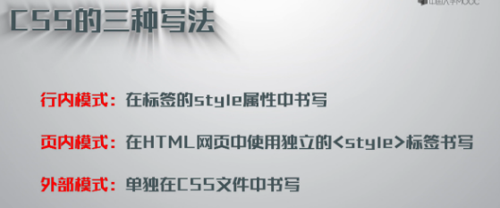
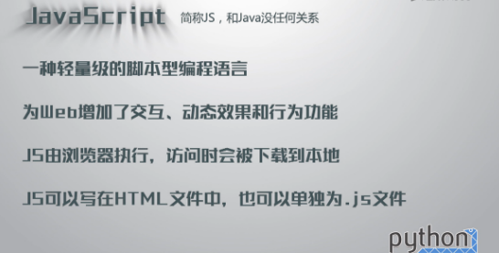
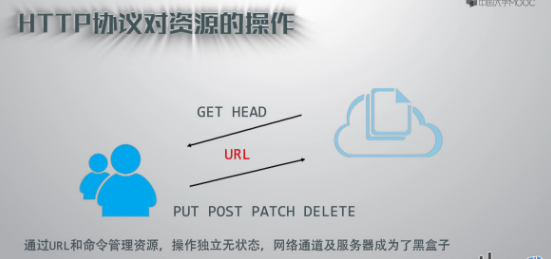

# 开发云端系统的技术架构

### 远端全栈开发技术

全栈：概念和技术的有效结合
任何东西都有，理念，设计，技术三个层次
三个层次都有所涉猎，就可以达到全栈

全能选手 一定就是就是整个IT行业
硬，软，网
了解是很重要的，术业有专攻

#### 云端和应用端
1.  云端掌握应用逻辑
2.  云端存储应用数据
3.  云端控制应用权限
4.  云端体现应用智能
5.  应用只提供交互体验

随着html语言发展，如何实现人机交互，降低开发成本。桌面应用也是如此，采用第三方框架，后来就是用html方式开发桌面应用，逐渐成为主流。

云端不仅仅只是简单的脚本显示，也形成了独立的对外接口层，也有独立的表达接口的技术。

#### 云端全栈（Python体系）
前端技术：HTML,CSS,JAVASCRIPT
云端接口：JSON，AJAX，RESTful
Web服务器：Apache，Nginx，Tomcat
Web框架：Django，Tornado,Flask,Pyamid
业务逻辑：Python
数据库：Mysql，PostgreQL,Mongo,Sqlite

### HTML技术理念
超文本标记传输语言，计算机语言的一种扩展。
由浏览器负责解析HTML，并展示web页面内容，HTML所使用的标签是预定义的，浏览器可解析。HTML符合XML规范，是XML的一种实例。
HTML是目前为止，组织各类信息的有效方法。

2014年，发布了HTML5，是一个跨时代的，面对移动端。

- Web1.0
HTML+CSS 基本网页展示
- 2000年左右，使信息和数据表达得更加高效
Web 2.0
Ajax+JS+XML 高效的数据表达
异步的JS和HTML的交互，对于动态的信息，只取页面中变化的部分
- Web 3.0
HTML5+CSS3 Web自适应和普适应用

### CSS技术理念
HTML比较方便显示数据。
布局、显示风格和网页样式，层叠样式表
HTML负责数据组织，CSS负责样式表达，使得显示有更多效果。
HTML使用标签形式，CSS采用键值对形式

具体实现，CSS的三种写法

### JavaScript技术理念
如何让页面动起来？

百度的echarts.js,第三方库
<http://echarts.baidu.com>

### HTTP协议与web服务器
#### HTTP协议
超文本传输协议
HTTP是一个基于“请求和响应”模式的、无状态的应用层协议
HTTP协议采用url作为定位网络资源的标识。

HTTP协议提供的方法

通过url和相关命令

#### Web服务器
Web服务器（Web Server）是一个软件工具
是用于提供HTTP访问服务
只需要配置，不需要开发。
推荐Apache，Nginx

