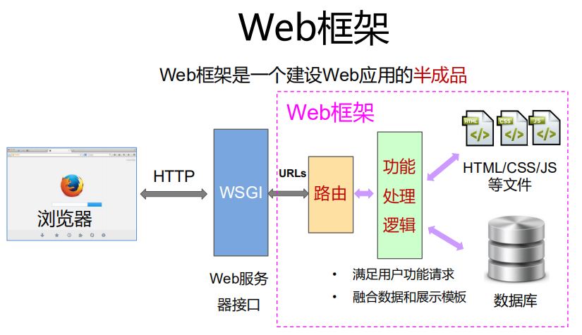
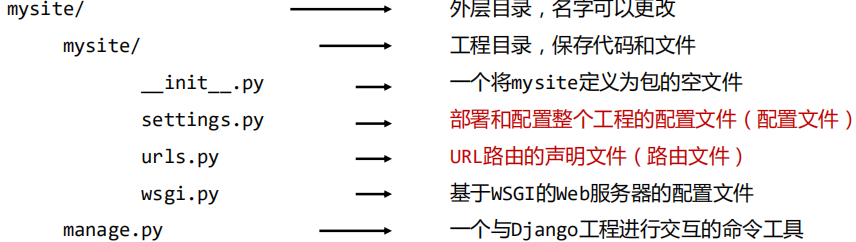
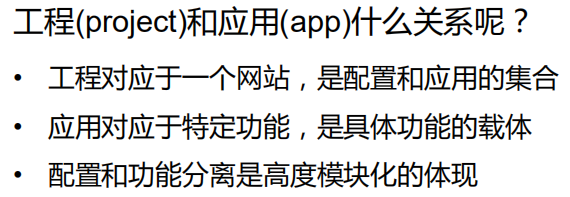
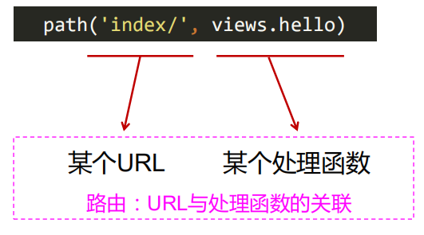
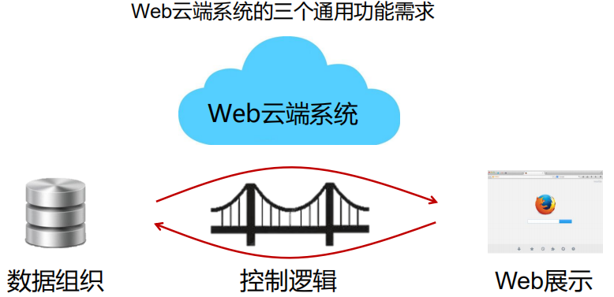
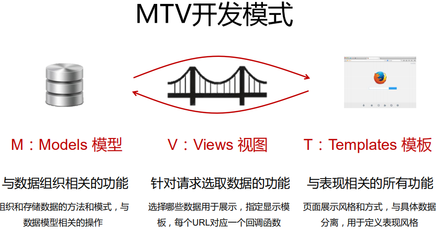
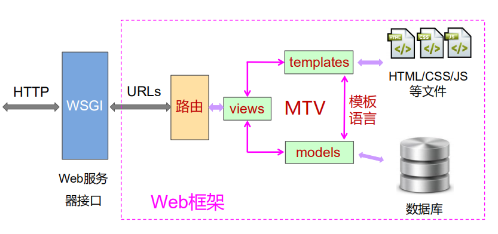
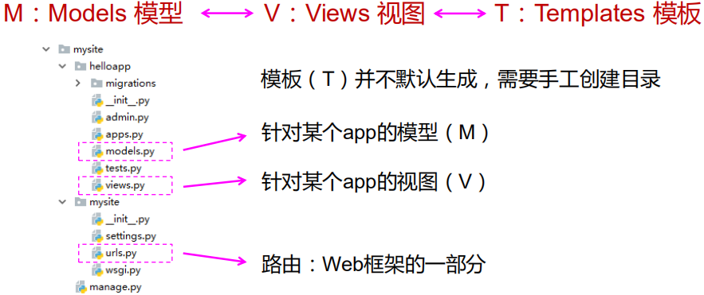

# django 框架基础

### django的理解

2017.12.02 发布的是2.x

- django是一个web框架
- django是一个产品级框架，有很大的应用
- 采用MTV（model-template-view）模式组织
- django充分利用python特点，开发效率高



定制 我们的路由

定制 html等静态资源文件，展示文件

设计数据库格式

功能处理逻辑（django 提供框架）


### django框架的最小程序

目录结构



django 自带调试用 web服务器


### django-admin和manag.py

```shell
django-admin <command> [options]
# 更多功能：
django-admin help
```

django-admin 是一个django框架全局的管理工具

- 建立并管理django工程
- 建立并管理django工程使用的数据库
- 控制调试或日志信息
- 运行并维护django工程

```shell
python manage.py <command> [options]
# 更多功能：
python manager.py help
```

与django-admin类似，但是只对当前项目，进行修改和维护。


### hello,django

创建一个具体应用（app）



> pycharm 上面tools ，**run manage.py** 然后输入相关命令，回车

1. 修改应用（app）的view.py

views.py 中包含对某个http请求（url）的响应

2. 修改url路由

在urls.py中指定url与处理函数之间的路径关系




### django的MTV开发模式



MTV 开发模式



M: 数据

V: 处理

T: 样式（显示风格）

> 这于mvc 功能的区别

MTV开发模式，放在web框架上的理解



MTV开发模式，放在实际项目目录中




### 利用MTV开发模式，修改hello

- 需求：返回一个html文件，而不是一个字符串
- 思路：建立模板（T）,对应特定请求，返回模板页面

- 实现步骤：


1. 编写返回页面，并修改views.py
  > render() 是一个打包函数，第一个参数是request，第二个参数是页面
2. 在应用文件夹中，新增urls.py文件，本地路由文件

> from . import views  # . 代表当前app，貌似不推荐
>
> urlpatterns 变量名固定

3. 在全局路由文件中增加对本应用路由文件的引用

> include() 函数，用于引入其他路由文件
>
> 将局部路由增加到全局路由中

4. 设置模板路径，让django框架找到模板所在目录


### 云端留言板 实例

- 基本功能定义：
- - 提交留言功能：
  - 言简易亥，通俗易懂
  - 1. 用户设定自己的名字为A，指定任意名字B
    2. 向B留言，记为msg，留言保存在云端
  - 获取留言功能：
  - 1. 输入名字A，云端返回10条最新留言
- 开发要求：
- - 弱化web设计，有简单web界面即可
  - 重视云端设计，掌握django库的使用
  - 数据用文件方式存储
- 开发流程：（如下）

1. 新建项目
2. 增加模板，配置路径

> django 定义的模板语言，{} 之类的

1. 设置url路由，本地路由和全局路由
2. 在view.py中编写交互代码

