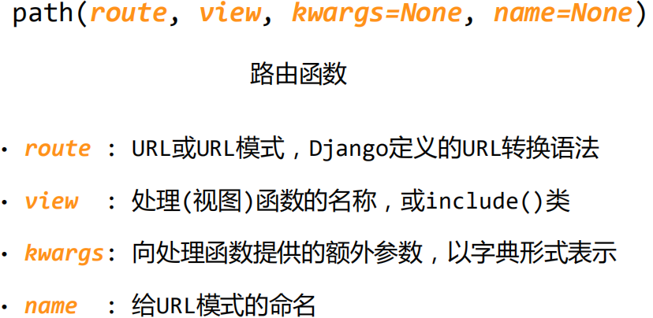
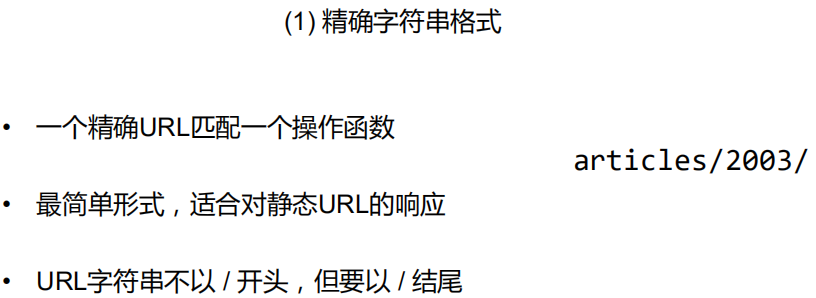
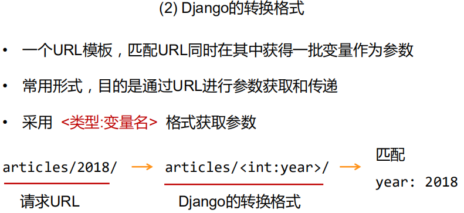
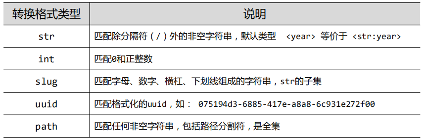
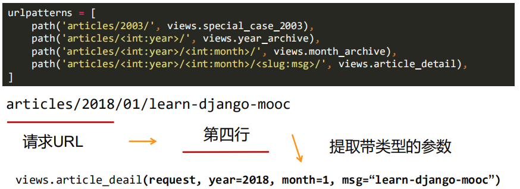
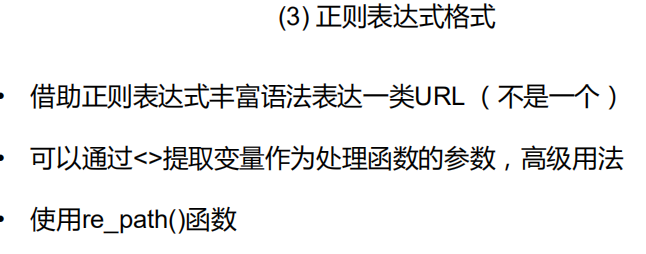
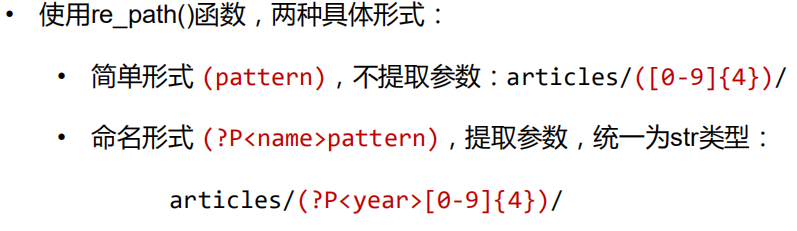
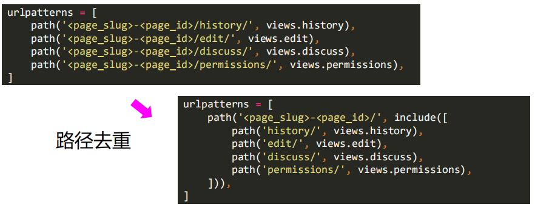

# django框架进阶

### django的路由机制

路由的作用：

从用户输入的url-->定义、转换、传参、命名等-->views

路由是关联url及其处理函数的关系

入口的路由文件  setting

ROOT_URLCONF  

> urlpatterns变量表示路由，该变量是列表类型，由path()或re_path()作为元素组成

#### url路由流程

1. django 查找全局urlpatterns 变量
2. django按照先后顺序，对url逐一匹配urlpatterns每个元素
3. 在找到第一个匹配时，停止查找，根据匹配结果执行对应处理函数
4. 如果没有找到匹配或出现异常，django进行错误处理

> django的路由不考虑http请求方式，仅根据url进行路由，即只要url相同，无论post、get等哪种请求方式都指向同一个操作函数

#### path() 和 re_path() 区别

path()处理字符串路由，re_path() 处理正则表达式路由

#### 路由函数参数

#### route的格式和转换，类似PathVariable

> 最后加上 / 分隔符

django支持三种方式表达route

- 精确字符串格式: article/2019/
- django的转换格式： <类型：变量名>，article/<int:year>/
- 正则表达式格式：article/(?P<year>[0-9]{4})/

转换格式实例：

正则表达式，提取参数：

### view 处理函数和include()函数

- 处理函数：view.py中处理url的对应函数，url处理的归宿
- include()函数：包含其他路由信息的函数，分段路径组合形成总路径

include()用法： 1. 附加本地路由，2. 路径去重

