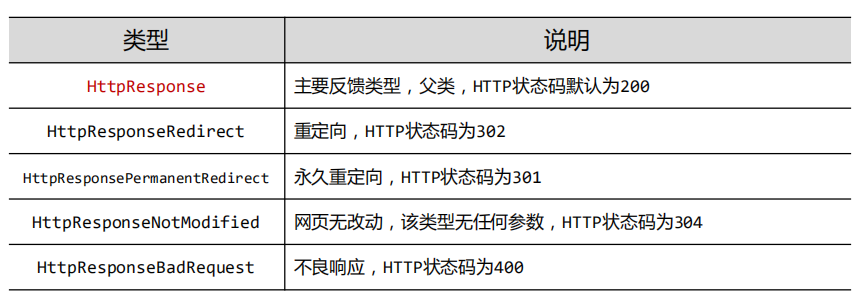
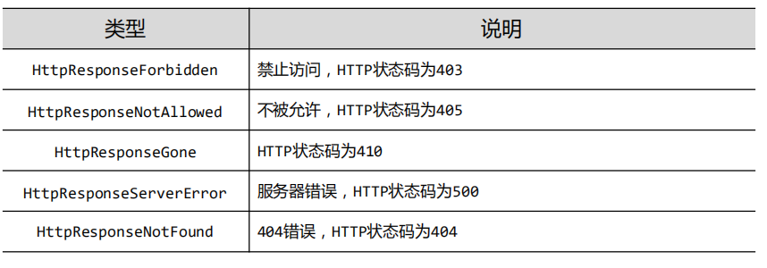
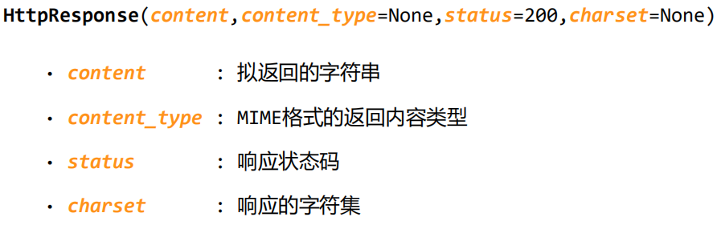
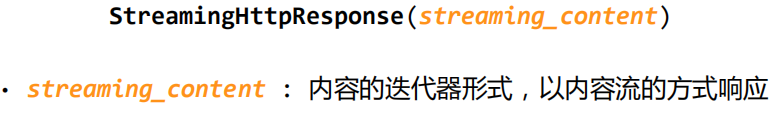
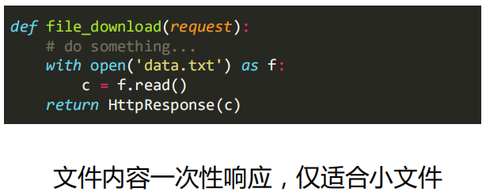
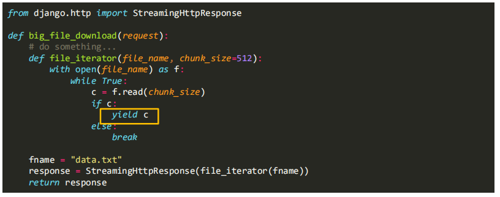
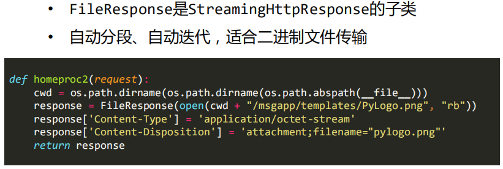

# django的视图响应类型

### 视图函数编写原则

视图函数接收http请求(request)并返回响应(response)，可以放在任何地方，可以实现任何功能

- 视图函数可以返回web文本，页面，重定向，错误，图片等任何内容
- 视图函数通过HttpResponse,JsonResponse等类表达并返回响应
- 按约定，视图函数放在对应app中的views.py文件中

### django的响应类型

django.http包含所有响应类型

- HttpResponse类及子类（共10个）
- JsonResponse类
- StreamingHttpResponse类
- FileResponse类





HttpResopnse 响应函数



JsonResponse 类


SteamingHttpResponse 类




### django请求类型的判断

`django.views.decorators.http`

- 路由不能判断http请求的类型
- django通过decorators在视图函数前进行基本判断，格式如下：

```python
from django.views.decorators.http import require_http_methods

# 之前，有这样这个定义
@require_http_methods(['GET','POST'])
def my_view(request):
    
    pass
```

> 这样的注解模式

### django的视图流式响应机制

一次性响应 vs 流式响应

流式响应：

- SteamingHttpResponse类
- FileResponse类

大文本文件传输

大二进制文件传输

#### 实例：文件下载

1. HttpResponse 方式



2. StreamingHttpResponse 方式

- 将文件分段，每次传输一部分，分段大小可调
- 利用python的迭代器产生分段
- 可以是文件，也可以是任何大规模数据响应




#### yield 关键字

用于处理 大规模数据 场景，经常会使用到

yield 生成器

iterator 迭代器

包含yield语句的函数是一个生成器（迭代器的一种），生成器每次产生一个值（yield语句），函数被冻结，被唤醒后后再产生一个值

生成器就是一个不断产生值得函数


FileResponse方式



> MIME 标记
>
> - Content-Type 用于指定文件类型
> - Content-Disposition 用于指定下载文件得默认名称
> - 这两者是MIME类型得标准定义
> - 有这两个标记，再界面上，体现的就是文件下载