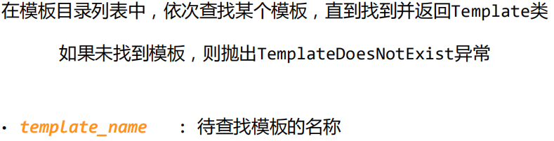
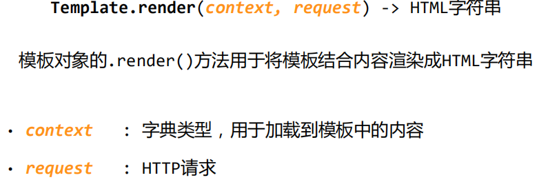
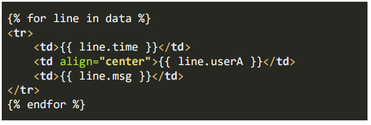
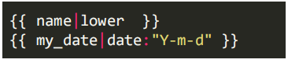

# django得模板引擎与模板使用

模板引擎是模板响应的后端

模板引擎的配置

setting.py 文件中对模板引擎进行配置（BACKEND）

模板文件 模板目录 

`'DIRS'`在列表中的顺序是搜索模板的顺序

### 模板查找

`get_template(template_name)`

`select_template(template_name_list)`

与get_template()相似，依次按照模板列表查找某个模板，知道找到第一个并返回Template类。

### 模板的渲染

渲染`render()` 将模板和内容整合到一起，返回html字符串

### 模板语言

Template Language

指导模板加载数据方式的工具

作为一个小型的编程语言，它也有自己的语法

- 注释  comment
- 变量  variable
- 标签  tags
- 过滤器  filter

关键语法

标签 

标签中的关键字包括

for, endfor, block, endblock, if, elif, else, endif, in, trans, as, with, extends等

过滤器

{{ name|过滤标签 }}

{{ name |f1|f1 }}

过滤器对变量的值进行修饰

lower， escape, linebreaks, date, length等

